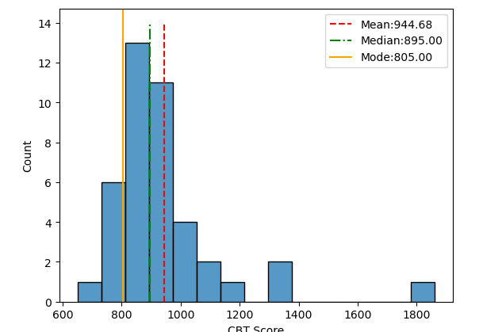
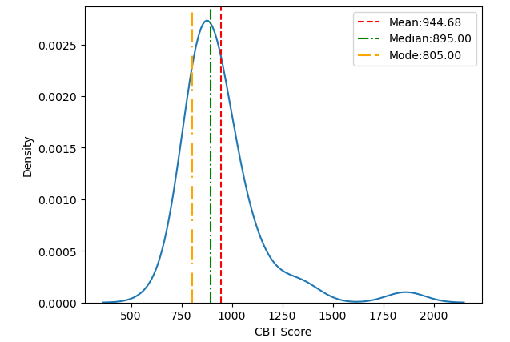

# CBT Results Analysis 📊

## Overview
Analysis of Computer Based Test results focusing on performance patterns and average scores across Data Science Faculty in Kathamandu University.

## Project Description
This project analyzes CBT (Computer Based Test) assessment results to understand:
- Performance patterns
- Average scoring trends
- Statistical insights from test data

## Key Findings
- Most of the Students in the DSc scores around 800 - 950 in CBT.
- There is no any marks around 1400 - 1800 but One student has got above 1800+.
- The score pattern to an extent follows Normal distribution.

## Visualizations

## Project Structure
This repository is structured as follows:

* **`3.notebooks/`**: Contains the Jupyter notebooks used for data cleaning, analysis, and visualization.
    * **`CBT_Analysis.ipynb`**: The main notebook with all the code for the project.
* **`data/`**: Holds the raw and processed data files.
    * **`student-scores.csv`**: The dataset used for the analysis.
* **`images/`**: Stores the output visualizations.
    * **`CBT-Histogram.png`**: The histogram plot.
    * **`CBT-KDplot.png`**: The Kernel Density Estimate plot.
* **`README.md`**: This file, providing an overview of the project.
